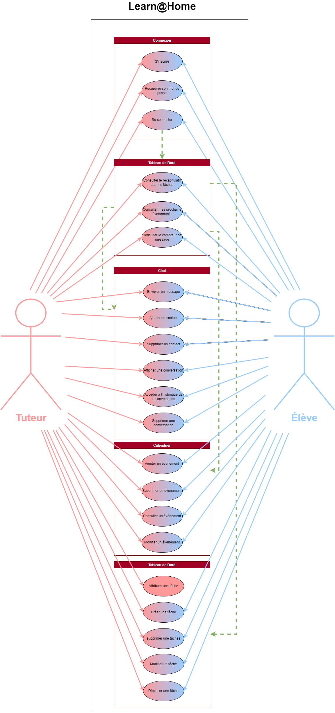
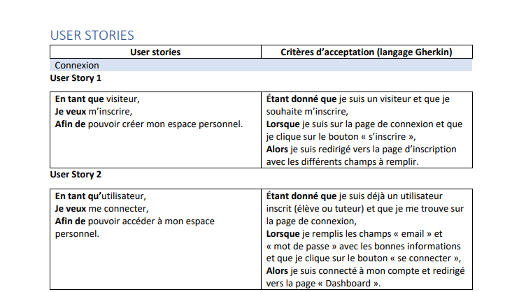
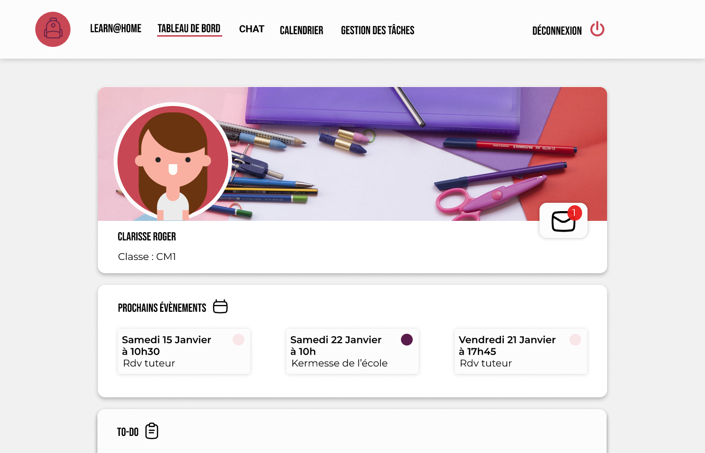
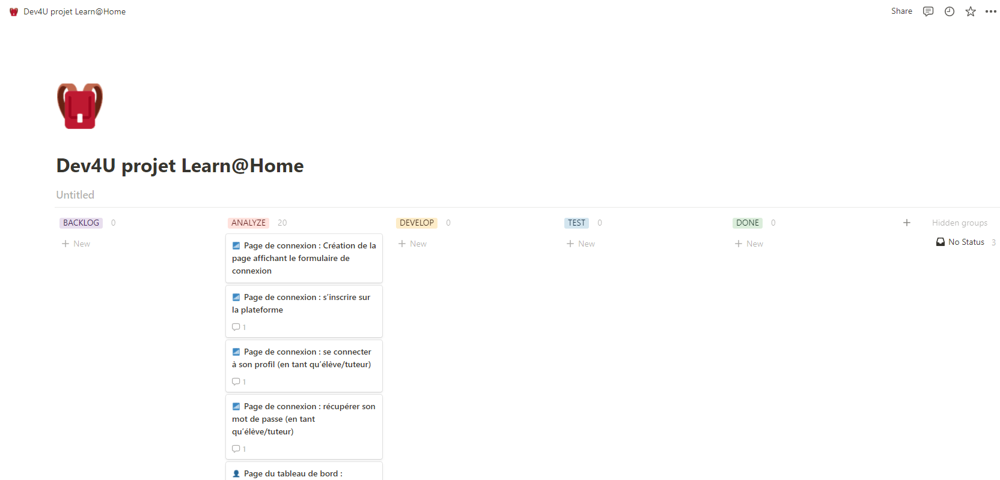

# Learn@Home
## Define the needs for a tutoring app 📚

---  

## Table of Contents
  - [Description](#description)
  - [Use case diagrams](#use-case-diagrams)
  - [User Stories](#user-stories-with-acceptance-criteria)
  - [Mock-ups](#mock-ups)
  - [Kanban](#kanban)
---

## Description

__*Learn@home*__ is the tenth project I made during this training. As a lead developer, I had a mission for the society "**Dev4U**". The goal 🎯 was to manage the development of a project. 

For this purpose, I had some task to realyse before the next meeting with the client :
- Use case diagrams for each of the major features of each page (login, chat, calendar, task manager, dashboard)
- User stories with acceptance criteria for each feature, shared in a standard format (PDF, DOCX, XLSX).
- Mock-ups with a simple design and at least one mock-up per page (you can use Figma or Sketch).
- A Kanban breaking down the project, in a macro way (excluding technical details) into blocks of features and sub-features for development. 

Moreover, I had at my disposal a [document](./readMe/synthesis_expectations_customer.pdf) synthesizing the expectations of the customer about features and mock-ups (wireframes).

[Back to the top](#description)

---

## Use case diagrams
> I used [draw.io](https://app.diagrams.net/), to realise this [diagram](readMe/use_case_diagram.png). 
> 

[Back to the top](#description)

---

## User stories with acceptance criteria

> Complete user stories [here](readMe/user_stories.pdf)
> 

[Back to the top](#description)

---

## Mock-ups

I realised mock-ups with [figma](https://www.figma.com/). The goal was to present the integration of the wireframes with the features by using logo as a starting point for the visual identity. So I realised a [Desktop](https://www.figma.com/file/WhjGhVBIYMxKFJiZzECTzT/Maquette-Learn%40Home?node-id=7%3A21) and a [Mobile](https://www.figma.com/file/WhjGhVBIYMxKFJiZzECTzT/Maquette-Learn%40Home?node-id=53%3A771) version of this project. 

[Back to the top](#description)

---
## Kanban
To set up the tasks to integrate the different features, I used [Notion](https://www.notion.so/).

> Complete Kanban [here](https://www.notion.so/Dev4U-projet-Learn-Home-49011b168a174d6788a33b8b01311c16)

[Back to the top](#description)

---
## Author info 
🧑‍🎓 Roy Framery
- [LinkedIn](https://www.linkedin.com/in/roy-framery/)

[Back to the top](#les-petits-plats)